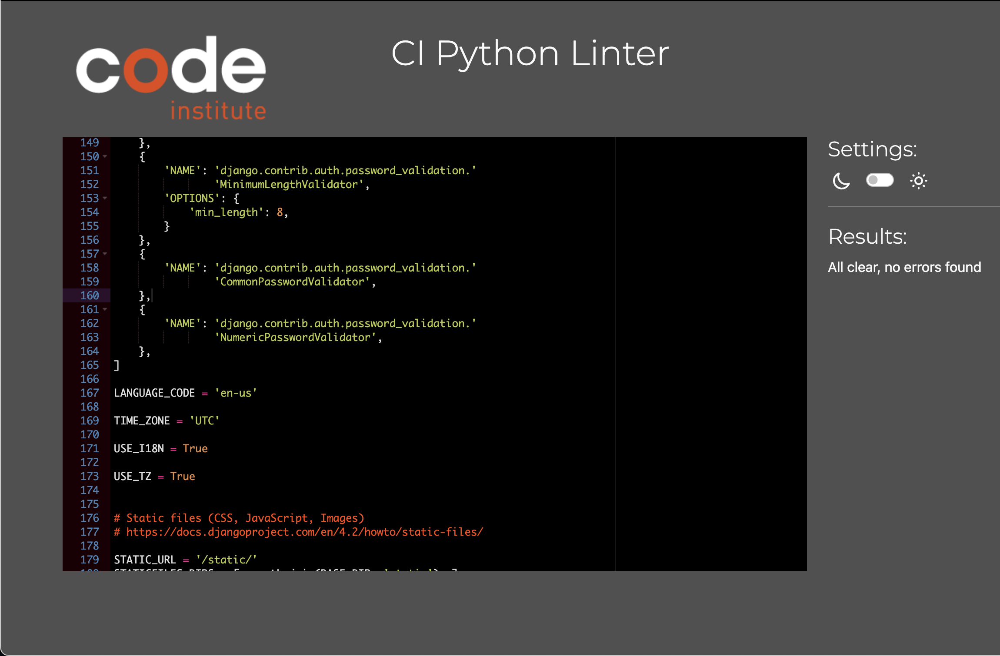

# Django Barber Shop Booking System

### Heroku Live link    https://barber-booking-6bf57636435a.herokuapp.com/

The Barber Shop is a live website with a booking system. It allows user to register, login, book appointments, submit contact messages, view Services & Prices and view gallery. 
The USP of this project is that the website is fully independant from any coders. I willk explain now what I mean;

While ideating for this project, I was wondering how this website can compete with the likes of 
Shopify, GoDaddy, Wix, etc as those are now the go-to website providers. The reason for that is because they are very user friendly and any person with a little knowledge of computers can create a website. Everything is already set up for you and all you have to do as a user is add images, colours and text of your products. Even themes have been created for you to choose from. 

So I decided to create something as close as possible to that structure and allow the owner of the website to change/add to the website without needing any help from the creator of the website (me).

In order to achieve this, I had to decide which are the most important factors of a barber shop website. 
1) A price list of the services you offer.
2) A gallery for potential customers to see your work.
3) An 'About Us' page to explain the journey of the business. 
4) A booking form to allow potential customers to book an appointment. 

So I decided to put control of all 4 of the above points in the website owners hands and I can happily say I have achieved what I had imagined. Although it is not perfect and it can and will imporve massively in the future, please take into consideration that I only had 2 weeks to finish this project. 

The website owner is able to add/edit/delete services & prices in the admin panel which will instantly display in the Services & Prices page on the website therefore allowing him to update prices without any help from any coder.

This is the same with the Gallery page. The website owner is able to add/delete images in the admin panel which instantly displays in the galleries page on the website.

They can also add/edit/delete an image and text for the About Us page.

Please NOTE: There are 2 different cut types in the admin page. I will now explain this;

The cut types in the HOME app will display the added cut type in the Services & Prices page on the website. 
The Cut Types in the APPOINTMENTS app will display the added cut type in the drop down selection in the booking form only. 
The reason why I seperated them is before I want to make the appointments cut types unique to the barbers. Some barbers may have skills which other barbers do not have and therefore they can do more cut types. And maybe the website owner offers services for walk-ins which he/she do not want to offer as an appointment. So I wanted to give the website owner control to decide which services he/she wants to offer to a walk-in customer and what they want to offer as an appointment. 

## Table of Contents
- [User Experience (UX)](#user-experience-ux)
  - [User Stories](#user-stories)
- [Features](#features)
  - [Existing Features](#existing-features)
    - [Nav Bar (Collapsable)](#nav-bar-collapsable)
    - [Landing/Home Page](#landinghome-page)
    - [Booking Page](#booking-page)
    - [Admin Page](#admin-page)
    - [Footer](#footer)
  - [Future Features](#future-features)
    - [Email Notification](#email-notification)
    - [Custom Booking Form](#custom-booking-form)
    - [Google Reviews Carousel](#google-reviews-carousel)
- [Design](#design)
  - [Images](#images)
  - [Colour Scheme](#colour-scheme)
  - [Wireframes](#wireframes)
- [Technologies Used](#technologies-used)
  - [Languages Used](#languages-used)
  - [Frameworks, Libraries & Programs Used](#frameworks-libraries-programs-used)
- [Data Models](#data-models)
- [Validator Testing](#validator-testing)
- [Deployment](#deployment)
- [Credits](#credits)

## User Experience (UX)

### User Stories
1. As a user I want to View the home page with navigation bar and footer so I can easily navigate through the website.
2. As a user I want to view the "Services & Prices" page so I can see the services offered and their prices.
3. As a user I want to view the "Gallery" page with pictures so that I can see images of the barber shop and its work.
4. As a user I want to view the "About Us" page so that I can learn more about the barber shop.
5. As a user I want to access the "Contact Us" page with a contact form so that I can reach out to the barber shop for inquiries.
6. As a user I want to click the "BOOK NOW" button so that I can choose a barber and service and book on them on a date and time that suits me.
7. As a user I want to register for an account so that I can book appointments and manage my bookings.
8. As a user I want to log in to my account so that I can access my booking details and manage my profile.
9. As a user I want to see social media icons in the footer I can easily access the barber shop's social media pages.
10. As a user I want to view available time slots for my chosen barber and service I can choose a convenient time for my appointment. 
11. As a user I want to see relevant links in the footer I can quickly find important information and navigate the website more efficiently.
12. As an admin I want to log in to the admin panel so that I can manage the website's content.
13. As an admin I want to edit services and prices so that I can keep the services and prices up to date.
14. As an admin I want to add, and remove pictures in the gallery so that I can update the visual content of the website.
15. As an admin I want to add and remove barbers who work at the shop so that I can remove barbers who don't work there anymore and add new barbers.
16. As an admin I want to manage user accounts and bookings so that I can assist users with their bookings and account-related issues. 

## Features

### Existing Features

#### Nav Bar (Collapsable)
- Desktop Nav bar 

- Mobile Nav bar 

- Mobile Nav bar - Collapsed 

#### Landing/Home Page

- Video at the top of the page.

- Buttons on the landing page: GALLERY, PRICES, CONTACT US, GOOGLE REVIEWS, BOOK NOW.

- Google reviews section.

#### Booking Page

- Dropdown to choose cut type.

- Dropdown to select barber (client's choice).

- Dropdown time slots in 15-minute intervals with selection restricted to opening times (9-6).

#### Admin Page

- Admin can add cut type name, price, and duration from the admin page using the home app, which will reflect on the main services & prices page.

- Admin can upload images in the admin page, which will be displayed on the main gallery page.

- Admin can add About Us image and text, which will be displayed on the main About Us page.

- Cut Type in the appointments app, differing from the home app, to offer separate services for walk-ins and booked appointments.

- Admin can add barber details, which will display on the home page under 'Meet Our Barbers' and update the barber choices on the booking page.

- Contact messages show messages sent by users via the contact form.

#### Footer
- Featured on all pages and identical on each page for consistency.
- Contains four sections:

  - Logo and social media icons.

  - Useful links: Home, Services, Gallery, About Us.

  - Contact us with address and phone number.

  - Opening hours.

#### Desktop Footer
  

#### Mobile Footer
  

### Future Features

#### Email Notification
- Email notification for admin and user upon registration, contact form submission, booking, editing, and cancelling an appointment.

#### Custom Booking Form
- Custom booking form with dynamic availability based on selected service and barber.

#### Google Reviews Carousel
- Integration of live Google reviews carousel on the home page.

#### Admin control over home page
- Admin will be able to also upload/delete the video on the top of the home page as well as the welcome message.

## Design

### Images
- Images and video sourced from [Pexels](https://www.pexels.com/).
- Logo created using [Logo.com](https://www.logo.com/).

### Wireframes

#### Home page

#### Services & Prices page

#### Gallery page

#### About Us page

#### Contact Us page

#### Login page

#### Register page

#### Booking page

#### Booking Confirmation page

## Technologies Used

### Languages Used
- HTML5
- CSS3
- Python

### Frameworks, Libraries & Programs Used
- Git
- GitHub
- Gitpod
- Django
- Cloudinary
- Bootstrap
- Google Fonts
- Font Awesome
- Balsamiq
- VS Code

## Data Models

### Relationships

### User Django (built-in)

### Appointment

### Profiles

### Barbers

### Cut Type

### Gallery

### About Us

### Contact Us 

## Testing

### Validator Testing

#### HTML Validator

- Home

- Services & Prices

- Gallery

- About Us

- Contact Us

- Register

- Login

- Log out question

- Manage Bookings

- Book Now 

- Booking Success 

- Edit Booking

- Cancel Booking

#### CSS Validator

#### Python Validator

- barber_shop/urls.py

- barber_shop/settings.py

- home/admin.py

- home/forms.py

- home/models.py

- home/urls.py

home/views.py

- appointment/admin.py

- appointment/forms.py

- appointment/models.py

- appointment/urls.py

- appointment/views.py

- barber/admin.py

- barber/forms.py

- barber/models.py

- barber/urls.py

- barber/views.py

- profile/forms.py

- profile/models.py

- profile/urls.py

- profile/views.py

#### Lighthouse

- Desktop

- Mobile 

#### Navigation Bar Links Manual Testing

| Link       | Expected Outcome                              | Grade |
|------------|-----------------------------------------------|-------|
| Logo       | Navigates to the home page      | Pass  |
| Home       | Navigates to the home page      | Pass  |
| Services & Prices      | Navigates to the Services & Prices page    | Pass  |
| Gallery | Navigates to the Gallery page | Pass  |
| About us  | Navigates to the About Us page | Pass  |
| Contact us  | Navigates to the Contact Us page | Pass  |
| Register  | Navigates to a registration form | Pass  |
| Log in     | Navigates to a screen where users can log in when clicked | Pass  |
| Logout     | Navigates to a page confirming for the user to log out   | Pass  |
| Book now  | Navigates to the login page if user is not logged in, or register page when user is not registered and if user is logged in, navigates to the booking form | Pass  |
| Manage bookings  | Navigates to a page where logged in user can see upcoming appointments | Pass  |
| Social Media Icons      | Navigates to the relevant social media site      | Pass  |

#### Website Forms Manual Testing

| Forms      | Expected Outcome                              | Grade |
|------------|-----------------------------------------------|-------|
| Contact Us form |  Sends the content of the contact form to the admin in the admin panel    | Pass  |
| Book now form      | Allows the user to select service, barber, time and date      | Pass  |
| Book now form submit     | Submits the booking form content to the admin in the admin page      | Pass  |

#### Admin Panel Manual Testing

| Admin tab      | Expected Outcome                              | Grade |
|----------------|-----------------------------------------------|-------|
| Home/Cut Types |  Adding a cut type will display on the Services & Prices page    | Pass  |
| Home/Gallery      | Adding an image will display on the Gallery page      | Pass  |
| Home/About Us content     | Allows admin to add/edit/delete content for the About Us page      | Pass  |
| Home/Contact Messages |  This will display the users contact form content    | Pass  |
| Barber/Barber |  Adding a barber will update the barber selection in the booking form and it will add the barber to the 'Meet the barbers' section in the home page    | Pass  |
| Appointments/Appointments |  This will display the booking form content selected by the user. Admin can also use this tab to create a new appointment  | Pass  |
| Appointments/Cut Types |  This will update the service selection for the user in the booking form    | Pass  |

### Responsiveness

#### Size: 320 x 667 MOBILE 

- Home 

- Services & Prices

- Gallery 

- Booking Form

#### Size: 768 x 889 LAPTOP

- Home 

- Services & Prices

- Gallery 

- Booking Form

#### Size: 1024 x 1334 DESKTOP

- Home 

- Services & Prices

- Gallery 

- Booking Form

## Deployment
- Deployed through Heroku.

## Credits

- ChatGPT
- Stack Overflow
- Ludiflex (Login Form) - [Ludiflex YouTube Video](https://www.youtube.com/watch?v=KWIM5FuUJ8U&t=1s)

