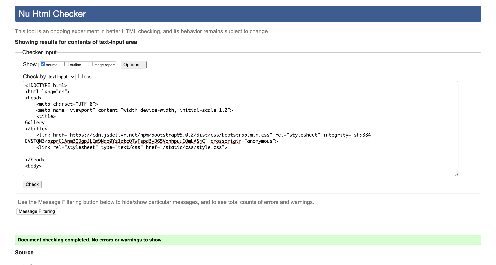

# Django Barber Shop Booking System

## Table of Contents
- [User Experience (UX)](#user-experience-ux)
  - [User Stories](#user-stories)
- [Features](#features)
  - [Existing Features](#existing-features)
    - [Nav Bar (Collapsable)](#nav-bar-collapsable)
    - [Landing/Home Page](#landinghome-page)
    - [Booking Page](#booking-page)
    - [Admin Page](#admin-page)
    - [Footer](#footer)
  - [Future Features](#future-features)
    - [Email Notification](#email-notification)
    - [Custom Booking Form](#custom-booking-form)
    - [Google Reviews Carousel](#google-reviews-carousel)
- [Design](#design)
  - [Images](#images)
  - [Colour Scheme](#colour-scheme)
  - [Wireframes](#wireframes)
- [Technologies Used](#technologies-used)
  - [Languages Used](#languages-used)
  - [Frameworks, Libraries & Programs Used](#frameworks-libraries-programs-used)
- [Validator Testing](#validator-testing)
- [Deployment](#deployment)
- [Credits](#credits)
- [Testing](#testing)

## User Experience (UX)

### User Stories
1. As a user I want to View the home page with navigation bar and footer so I can easily navigate through the website.
2. As a user I want to view the "Services & Prices" page so I can see the services offered and their prices.
3. As a user I want to view the "Gallery" page with pictures so that I can see images of the barber shop and its work.
4. As a user I want to view the "About Us" page so that I can learn more about the barber shop.
5. As a user I want to access the "Contact Us" page with a contact form so that I can reach out to the barber shop for inquiries.
6. As a user I want to click the "BOOK NOW" button so that I can choose a barber and service and book on them on a date and time that suits me.
7. As a user I want to register for an account so that I can book appointments and manage my bookings.
8. As a user I want to log in to my account so that I can access my booking details and manage my profile.
9. As a user I want to see social media icons in the footer I can easily access the barber shop's social media pages.
10. As a user I want to view available time slots for my chosen barber and service I can choose a convenient time for my appointment. 
11. As a user I want to see relevant links in the footer I can quickly find important information and navigate the website more efficiently.
12. As an admin I want to log in to the admin panel so that I can manage the website's content.
13. As an admin I want to edit services and prices so that I can keep the services and prices up to date.
14. As an admin I want to add, and remove pictures in the gallery so that I can update the visual content of the website.
15. As an admin I want to add and remove barbers who work at the shop so that I can remove barbers who don't work there anymore and add new barbers.
16. As an admin I want to manage user accounts and bookings so that I can assist users with their bookings and account-related issues. 

## Features

### Existing Features

#### Nav Bar (Collapsable)
- Desktop Nav bar 

- Mobile Nav bar 

- Mobile Nav bar - Collapsed 

#### Landing/Home Page

- Video at the top of the page.

- Buttons on the landing page: GALLERY, PRICES, CONTACT US, GOOGLE REVIEWS, BOOK NOW.

- Google reviews section.

#### Booking Page

- Dropdown to choose cut type.

- Dropdown to select barber (client's choice).

- Dropdown time slots in 15-minute intervals with selection restricted to opening times (9-6).

#### Admin Page

- Admin can add cut type name, price, and duration from the admin page using the home app, which will reflect on the main services & prices page.

- Admin can upload images in the admin page, which will be displayed on the main gallery page.

- Admin can add About Us image and text, which will be displayed on the main About Us page.

- Cut Type in the appointments app, differing from the home app, to offer separate services for walk-ins and booked appointments.

- Admin can add barber details, which will display on the home page under 'Meet Our Barbers' and update the barber choices on the booking page.

- Contact messages show messages sent by users via the contact form.

#### Footer
- Featured on all pages and identical on each page for consistency.
- Contains three sections:
  - Logo and social media icons.
  - Useful links: Home, Services, Gallery, About Us.
  - Contact us with address and phone number.
  - Opening hours.

### Future Features

#### Email Notification
- Email notification for admin and user upon registration, contact form submission, booking, editing, and cancelling an appointment.

#### Custom Booking Form
- Custom booking form with dynamic availability based on selected service and barber.

#### Google Reviews Carousel
- Integration of live Google reviews carousel on the home page.

#### Admin control over home page
- Admin will be able to also upload/delete the video on the top of the home page as well as the welcome message.

## Design

### Images
- Images and video sourced from [Pexels](https://www.pexels.com/).
- Logo created using [Logo.com](https://www.logo.com/).
- Screenshot: 

### Wireframes

#### Home page

#### Services & Prices page

#### Gallery page

#### About Us page

#### Contact Us page

#### Login page

#### Register page

#### Booking page

#### Booking Confirmation page

## Technologies Used

### Languages Used
- HTML5
- CSS3
- Python

### Frameworks, Libraries & Programs Used
- Git
- GitHub
- Gitpod
- Django
- Cloudinary
- Bootstrap
- Google Fonts
- Font Awesome
- Balsamiq
- VS Code

## Testing

### Validator Testing
- HTML Validator

#### Home

#### Services & Prices

#### Gallery

#### About Us

#### Contact Us

#### Register

#### Login

#### Log out question

#### Manage Bookings

#### Book Now 

#### Booking Success 

#### Edit Booking

#### Cancel Booking

- CSS Validator

## Deployment
- Deployed through Heroku.

## Credits

- ChatGPT
- Stack Overflow
- Ludiflex (Login Form) - [Ludiflex YouTube Video](https://www.youtube.com/watch?v=KWIM5FuUJ8U&t=1s)

## Testing
